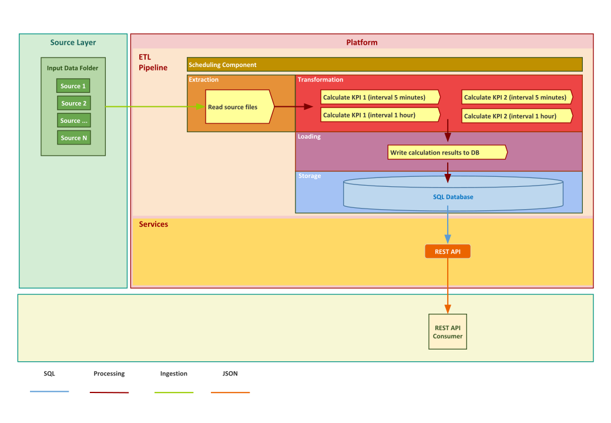

# Python Analysis (with MariaDB and Flask API)


This project is a Python implementation of a system for calculating mobile subscriber and network statistics from raw data. The raw data are produced by a 3rd party system and refer to the user activity in 5-minute time periods. They are produced in the form of CSV text files.

The purpose of the application is to calculate user and network KPIs (Key Performance Indicators) for 5-minute and 1-hour intervals and store them in the database. The KPIs to be calculated are the following:

- KPI1: Top 3 services by traffic volume: the top 3 services (as identified by service_id) which generated the largest traffic volume in terms of bytes (downlink_bytes + uplink_bytes) for the interval.

- KPI2: Top 3 cells by number of unique users: the top 3 cells (as identified by cell_id) which served the highest number of unique users (as identified by msisdn) for the interval.

The KPIs above are calculated for all 5-minute intervals within the day, but also for all 1-hour intervals of the day. So, for each 5-minute KPI there are calculations for the intervals: 00:00 – 00:05, 00:05 – 00:10, 00:10-00:15, etc. For each 1-hour KPI, this is done for: 00:00 – 01:00, 01:00 – 02:00 etc. The results are stored in one database table for each KPI.

## High Level System Design

In the image below you can see the design of the system on a high level:



## API Design

The API consists of two resources (kpi1, kpi2).

Each resource corresponds to an endpoint (eg. http://127.0.0.1:5000/kpi1 and http://127.0.0.1:5000/kpi2)

Each endpoint accepts GET requests with optional query string parameters.

Query string parameters appear after a question mark (?) in the endpoint. The question mark followed by the parameters and their values is referred to as the "query string". In the query string, each parameter is listed one right after the other with an ampersand (&) separating them. The order of the query string parameters does not matter.

For example:

http://127.0.0.1:5000/kpi1/?from=2017-03-01_10:00:00&to=2017-03-01_10:05:00&interval=5-minute

contains the following query string parameters:

- **from** (value = 2017-03-01_10:00:00)
- **to** (value = 2017-03-01_10:05:00)
- **interval** (value = 5-minute)

You can use any combination the above parameters to get the desired range of records from the database. You can also use the endpoint without a query string to get the full database contents for the particular KPI.

The results are returned in a JSON list with different fields depending on the KPI. You can find examples below.

**Example results for KPI1:**

```json
[
  {
    "interval_start_timestamp": "2017-03-01 10:00:00",
    "interval_end_timestamp": "2017-03-01 10:05:00",
    "service_id": 1,
    "total_bytes": 16100,
    "interval": "5-minute"
  },
  {
    "interval_start_timestamp": "2017-03-01 10:00:00",
    "interval_end_timestamp": "2017-03-01 10:05:00",
    "service_id": 3,
    "total_bytes": 11500,
    "interval": "5-minute"
  },
  {
    "interval_start_timestamp": "2017-03-01 10:00:00",
    "interval_end_timestamp": "2017-03-01 10:05:00",
    "service_id": 2,
    "total_bytes": 9260,
    "interval": "5-minute"
  }
]
```

**Example results for KPI2:**

```json
[
  {
    "interval_start_timestamp": "2017-03-01 10:00:00",
    "interval_end_timestamp": "2017-03-01 10:05:00",
    "cell_id": 1001,
    "number_of_unique_users": 4,
    "interval": "5-minute"
  },
  {
    "interval_start_timestamp": "2017-03-01 10:00:00",
    "interval_end_timestamp": "2017-03-01 10:05:00",
    "cell_id": 5005,
    "number_of_unique_users": 3,
    "interval": "5-minute"
  },
  {
    "interval_start_timestamp": "2017-03-01 10:00:00",
    "interval_end_timestamp": "2017-03-01 10:05:00",
    "cell_id": 1000,
    "number_of_unique_users": 3,
    "interval": "5-minute"
  }
]
```

## Prerequisites

Before you begin, ensure you have met the following requirements:

<!--- These are just example requirements. Add, duplicate or remove as required --->

- A `Linux` machine
- Git
- Python 3.6.8 (and above)
- Docker and docker-compose

_Note:_ The following instructions are for Ubuntu Linux but should work in any Debian based Linux.

### Clone this repo

```bash
git clone git@github.com:sgioldasis/python-analysis-api.git
cd python-analysis-api
```

### Install Git

```bash
sudo apt update
sudo apt install git
```

### Install Python

You can follow any method appropriate for your system to install Python 3.6.8. Using a Python virtual environment is recommended. If your system already has another python version you can follow the link to install
[multiple python versions with pyenv](https://realpython.com/intro-to-pyenv/)

Once you have installed Python you also need to install the Python `pip` package manager. For example you can run the following commands:

```bash
sudo apt install python-pip
pip install --upgrade pip
```

### Install Docker Engine and Docker Compose

You can find instructions for your system in the links below:

- [Install Docker Engine](https://docs.docker.com/install/)
- [Install Docker Compose](https://docs.docker.com/compose/install/)

## Initial Setup

It is recommended to first setup and activate a Python 3.6.8 virtualenv. If you use `pyenv` you can type the following inside your main project folder (python-analysis-api):

```shell
pyenv virtualenv 3.6.8 venv-paa
pyenv local venv-paa
pip install --upgrade pip
```

With the above setup, next time you cd to your folder the virtualenv `venv-paa` is going to be activated automatically.

After you activate your virtualenv, the next step is to install the Python requirements. To do that you can type the following inside your main project folder:

```shell
make install
```

## Testing

### Using Python Interpreter

You can run the tests using your local Python interpreter by typing:

```shell
make test
```

The above command will first use Docker Compose to start a local infrastructure (MariaDB), then run the tests using your local Python interpreter and finally stop the local docker infrastructure. You should see in your terminal the test output and also a coverage summary. After you run the test you can also open `htmlcov/index.html` to see a detailed coverage html report in your browser.

### Cleaning test files

You can clean _Pytest_ and coverage cache/files by typing the following:

```shell
make clean
```

## Running

### Using Python Interpreter

You can run the program by typing:

```shell
make run
```

You will see program output in your console. First the ETL will run and populate the database and then the API server will run. You will see the output `Running on http://127.0.0.1:5000/ (Press CTRL+C to quit)`. You can visit the API endpoints http://127.0.0.1:5000/kpi1 and http://127.0.0.1:5000/kpi2 in your browser to see the database contents. You can also apply filters using query parameters (from, to, interval). For example http://127.0.0.1:5000/kpi1/?from=2017-03-01_10:00:00&to=2017-03-01_10:05:00&interval=5-minute will give you only the specified range of records.

The server will keep running until you press `Ctrl-C` in which case it will exit. Once the server exits, you can bring down the docker infrastructure by typing:

```shell
make infra-down
```

## Blog Posts - More Information About This Repo

You can find more information about the template used to setup this project/repository and how to use it in following blog posts:

- [Ultimate Setup for Your Next Python Project](https://towardsdatascience.com/ultimate-setup-for-your-next-python-project-179bda8a7c2c)
- [Automating Every Aspect of Your Python Project](https://towardsdatascience.com/automating-every-aspect-of-your-python-project-6517336af9da)
